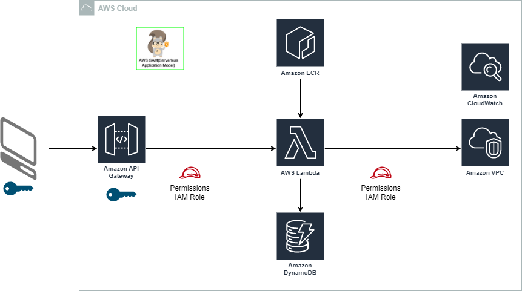

# Create VPC and get the VPC list
This Lambda function is responsible for **creating and listing VPCs** based on input received from the associated API 
Gateway method and resource. It is centrally deployed within the **Nextgen-Infra account** (a private AWS account), 
located in the us-east-2 (Ohio) region.

The function is deployed under the name: **rg-test-api-lambda**

## Code Trigger
* The Lambda function is triggered by a **API Gateway Method**.

## Description
1. Invoke this using a API gateway method. Use POSTMAN or similar tools to invoke the API.
2. There are 2 methods available:
   * **POST**: Create a VPC
   * **GET**: List all VPCs
3. Below are the URLs for each of these methods. 
   * **POST**: 
   https://2jai3icm5b.execute-api.us-east-2.amazonaws.com/us-east-2-rg-test-api-rg-api-lambda-project-Stage/create
   * **GET**: 
   https://2jai3icm5b.execute-api.us-east-2.amazonaws.com/us-east-2-rg-test-api-rg-api-lambda-project-Stage/vpcs
4. Both are protected using **API key based authentication**.
5. **POST** method creates a VPC and associated subnets with the following parameters. It also makes an entry in the 
   DynamoDB table.
   * **Name**: Name of the VPC
   * **CIDR**: CIDR block for the VPC
   * **Subnets**: List of subnets to be created
   * **Tags**: Tags for the VPC
6. **GET** method lists VPCs which are created above. The list is retrieved from the dynamoDB table.

## Components:
* **Lambda Function:** rg-test-api-lambda
* **API Gateway:** rg-test-api
  * **Usage Plan:** rg-test-api-usage-plan
  * **API Key:** rg-test-api-key
* **DynamoDB Table:** rg-test-api-lambda-dynamodb
* **IAM Roles:** rg-test-api-lambda-SR-ApiGateway, rg-test-api-lambda-SR-Lambda
* **ECR repo:** rg-api-lambda-project

## Artifacts:
* **src/index.py:** The main Lambda function code.
* **src/logutil.py:** The log handling function.
* **requirements.txt:** The dependencies for the Lambda function.
* **Dockerfile:** The Dockerfile for building the Lambda function container image.
* **README.md:** The README file for the Lambda function.
* **template.yaml:** SAM template file for installing the infrastructure.
* **.github/workflows/rg-api-lambda-project.yml:** The GitHub Actions workflow for deploying the components.

## Implementation:
The entire solution is deployed through an automated CI/CD pipeline. A **Serverless Application Model (SAM)** template 
is utilized to define and provision the infrastructure via a CloudFormation stack. Deployment is orchestrated using a 
GitHub Actions workflow, which is automatically triggered on every push to the main branch.
The AWS Lambda function is packaged and deployed as a container image, which is built using a Dockerfile included in 
the repository. The image is then pushed to an Amazon Elastic Container Registry (ECR) repository for deployment.

If you donot want to use github workflow, follow these steps to deploy the components:
Go to the working directory ./rg-api-lambda-project execute the below commands -
* `sam build --debug`
* `sam deploy --stack-name rg-api-lambda-project --capabilities CAPABILITY_NAMED_IAM --region us-east-2 
--no-fail-on-empty-changeset --image-repositories 
rgLambda=257676781382.dkr.ecr.us-east-2.amazonaws.com/rg-api-lambda-project --parameter-overrides 
"SecurityGroupIds=sg-0c37a80d7ad4786b4" "Subnets=subnet-0942d4e5e58f733e2,subnet-012344d2e071d6770,subnet-0f080e257d72e48d4"`

## Monitoring
* You can view the CloudWatch logs in the CloudWatch console and see real-time metrics and logs.

## Troubleshooting

* **Lambda Errors:** Check the CloudWatch Logs for the Lambda functions to diagnose and fix any issues.

## Documentation

